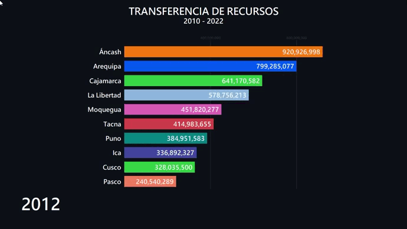

<br/>
<p align="center">
  <h1 align="center">Animación Gráfico de Barras</h1>

  <p align="center">
    Transferencia de Recursos (Canon minero, Regalías Mineras y Derecho de Vigencia y Penalidad) 2010 - 2022
    <br/>
    <br/>
  </p>
</p>


## Tabla de Contenido

* [Getting Started](#getting-started)
  * [Instalación](#instalación)
  * [Uso](#uso)
* [Demo](#demo)
* [Source](#source)
* [Autor](#autor)
* [Contacto](#contacto)

## Getting Started
Para ejecutar la animación del gráfico de barras en tu equipo, sigue los siguientes pasos detallados:


### Instalación

1. Puedes descargar el repositorio [aquí](https://github.com/Jinder2050/Animacion-TransferenciasMineras/archive/refs/heads/main.zip).

2. También puedes clonar el repositorio desde el terminal:

```sh
git clone https://github.com/Jinder2050/Animacion-TransferenciasMineras.git
```

3. Ve al directorio **Animacion-TransferenciasMineras**
```sh
cd Animacion-TransferenciasMineras
```

4. Instala las librerías necesarias de `requirements.txt`

```sh
pip install -r requirements.txt
```

### Uso

Para visualizar la animación ejecuta el archivo `assets/main.py`
```sh
cd assets
```
```sh
python3 main.py
```

## Demo

<p align="center">

  

</p>

Vea la animación completa [aquí](https://www.linkedin.com/in/yiender-condori-galdos-6a536020b/).

## Source
* [Boletín Estadístico Minero (BEM)](https://www.gob.pe/minem)

* [MEF - Portal de Transparencia Económica, Instituto Geológico Minero y Metalúrgico (INGEMMET)](https://www.mef.gob.pe/es/?option=com_content&language=es-ES&Itemid=100143&lang=es-ES&view=category&id=661)

## 
## Autor

* **[Jinder2050](https://github.com/Jinder2050)** - *Mining Engineering Student* 

***Agradecemos cualquier retroalimentación o sugerencias.***

## Contacto
<div class="estilo" align="center" style="display:block;">
        <a href="https://github.com/Jinder2050" target="_blank" style="padding: 0.2rem;"></a>
        <a href="https://www.facebook.com/JiNnDeRC" target="_blank" style="padding: 0.2rem;"></a>
        <a href="https://www.instagram.com/jinnder07/" target="_blank" style="padding: 0.2rem;"></a>
        <a href="https://www.linkedin.com/in/yiender-condori-galdos-6a536020b/" target="_blank" style="padding: 0.2rem;"></a>
</div>
<br>

